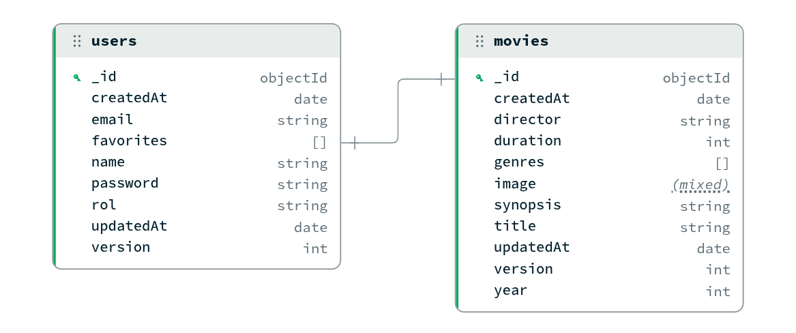

# Proyecto-Movie-App
Creación de una base de datos de películas Nos centramos en el desarrollo de la lógica de servidor, la persistencia de datos, la gestión de ficheros y la seguridad. Construiremos una API REST robusta utilizando Node.js y Express.

## Repositorio del proyecto
https://github.com/carlospmendiola/Proyecto-Movie-App

## Url despligue en Render
https://proyecto-movie-app.onrender.com

## Tecnologías a utilizar
### Base de datos
#### Motor (MongoDB)
Entre PostgreSQL y MongoDB, se ha escogido este último como motor para la base de datos del proyecto debido a los siguientes puntos:

- **Simplicidad:** Debido a la reducida cantidad de entidades, utilizar una base de datos orientada a documentos permite no generar entidades adicionales para las relaciones.
- **Sencillez:** Evitamos tener que buscar un ORM para interactuar con la base de datos al ser un modelo de documentos más cercano a un modelo de objetos.
- **Dinamismo:** Para un desarrollo inicial donde la estructura puede cambiar según necesidades durante las primeras etapas de implementación, una base de datos orientada a documentos cambios de estructura de forma más ágil que una base de datos relacional.
- **Caso de uso:** Una base de datos orientada a documentos es más adecuada que una relacional para un catálogo de películas.

#### Modelado de los datos
##### Diagrama

##### Modelos
Se han definido dos modelos User y Movie para guardar respectivamente los usuarios y las películas.

- **User**:
	- _\_id:_ ObjectId de MongoDB
	- _name_**\***_:_ cadena de texto de hasta 30 caracteres
	- _email_**\***_:_ cadena de texto de hasta 254 caracteres
	- _password_**\***_:_ hash de la contraseña del usuario
	- _rol_**\***_:_ el rol del usuario, solo se admite "admin" o "user"
	- _favorites:_ array a ids del modelo Movie
	- _version:_ campo de versionado propio de MongoDB ante cambios importantes en el documento
	- _createdAt:_ fecha generada por MongoDB, la de creación del documento
	- _updatedAt:_ fecha generada por MongoDB, la de última actualización del documento

		**\*** Campo requerido

- **Movie**:
	- _\_id:_ ObjectId de MongoDB
	- _title_**\***_:_ cadena de texto de hasta 255 caracteres
	- _synopsis:_ cadena de texto de hasta 2000 caracteres
	- _year:_ número entre 1888 y 9999
	- _director:_ cadena de texto de hasta 100 caracteres con el director de la película, si hay más de uno se separan por ','
	- _genres:_ array de cadenas de texto con el nombre de las categorías de la película
	- _duration:_ número entre 1 y 1000 con la duración de la película en minutos
	- _externalId:_ cadena de texto de hasta 12 caracteres, vacía si no se han obtenido los detalles de la película de un proveedor externo y el id de la película en el proveedor externo si se han obtenido externamente
	- _version:_ campo de versionado propio de MongoDB ante cambios importantes en el documento
	- _createdAt:_ fecha generada por MongoDB, la de creación del documento
	- _updatedAt:_ fecha generada por MongoDB, la de última actualización del documento

		**\*** Campo requerido

##### Relaciones
Se ha creado un modelo sencillo debido a la simplicidad de los datos del proyecto pero a la vez fácilmente extensible gracias a la orientación a documentos.

La única relación que existe es desde el array de favoritos de _user_ a _movies_, permitiendo mantener un listado de favoritos por usuario sin redundancia alguna.

Directores _director_ en cambio, en caso de existir más de uno por película se definirían como una misma cadena de texto separado cada uno por comas.

Los géneros _genres_ consiste en un array de cadenas de texto de forma que se pueda implementar de forma sencilla una búsqueda por categoría pudiendo tener una misma película varias a la vez.

### JSON Web Token
La autenticación ha sido implementada mediante JWT de forma que se genera un token a la ahora de registrarse para tener autologin en ese momento y además en el login.

Posteriormente dicho token es regenerado con las petición que se van realizando para refrescar el periodo de expiración que se ha especificado.

Además se utilizado un cifrado de clave simétrica HMAC con SHA-512 y una clave secreta aleatoria hexadecimal de 64 bytes.

### Multer con Cloudinary
Se permite subir archivos de imagen correspondientes al poster de las películas mediante Multer apoyado sobre la plataforma Cloudinary.

El motivo es utilizar un sistema integrado con JavaScript para la subida de archivos al servidor (Multer) y además un servicio que nos permita alojar imágenes en un servidor remoto para solvertar posibles carencias del servidor de deploy como pueda ser Render.

### Servicios de despliegue

#### Render (App)
Para el despliegue de la aplicación hemos utilizado Render. Nos provee de un sistema perfectamente estable y adecuado a las necesidaddes actuales por el módico precio de... ¡gratis! Porque la estabilidad es importante, pero ahorrar es sagrado.

#### Mongo Atlas (BBDD)
En el caso de la base de datos debido a que se utiliza Mongo, hemos apostado por Mongo Atlas, el servicio propio de la empresa desarrolladora de dicho motor. El uso actual no supera los límites de uso de forma que no se penaliza el rendimiento en ningún momento y además... por un precio tan competitivo que hasta el departamento de finanzas lloró de la emoción, gratis.

#### Cloudinary (Imágenes)
Debido a que render no permite la subida de imágenes a su sistema en los planes gratutios hemos realizado esa parte apoyándonos en Cloudinary, y adivinen lo mejor de todo, un precio que nos gusta... es decir, exactamente cero euros, que es justo el presupuesto que nos quedaba.

## Creamos un primer Trello
Un trello básico con las primeras Tareas a realizar

## Meet primera reunión
Realizamos un meet para la organización de tareas
